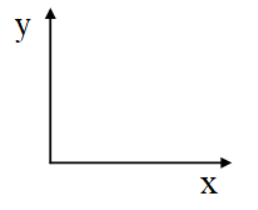
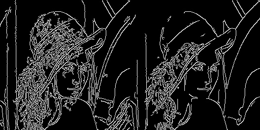
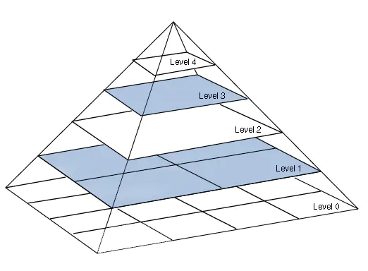
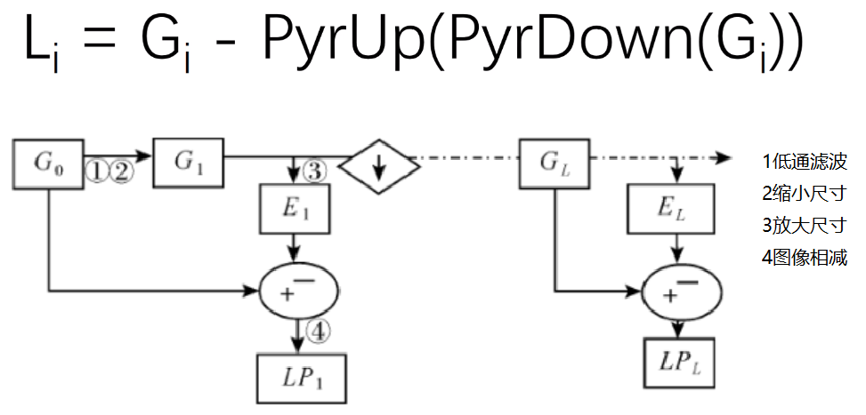
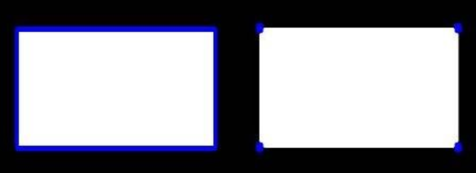
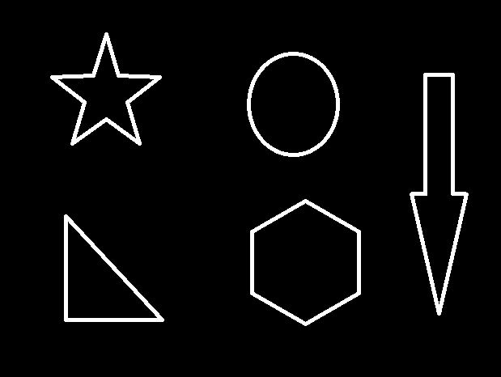
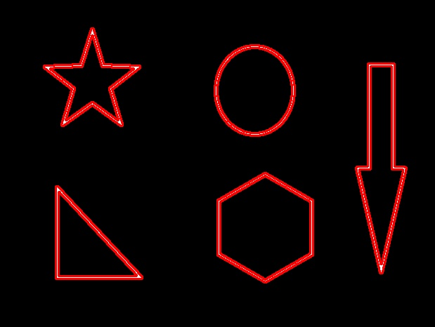
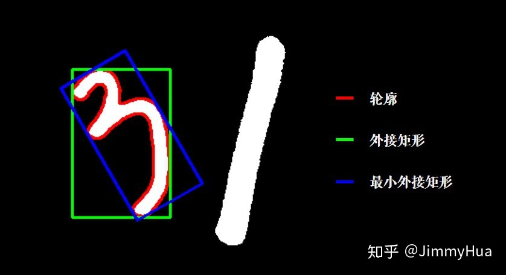

# opencv 图像处理 

​	

​	OpenCV是一个基于BSD许可（开源）发行的跨平台计算机视觉和机器学习软件库，可以运行在Linux、Windows、Android和Mac OS操作系统上。 [1] 它轻量级而且高效——由一系列 C 函数和少量 C++ 类构成，同时提供了Python、Ruby、MATLAB等语言的接口，实现了图像处理和计算机视觉方面的很多通用算法。

​	OpenCV用C++语言编写，它具有C ++，Python，Java和MATLAB接口，并支持Windows，Linux，Android和Mac OS，OpenCV主要倾向于实时视觉应用，并在可用时利用MMX和SSE指令， 如今也提供对于C#、Ch、Ruby，GO的支持。

​		<span style=font-size:20px><u>**OpenCV的颜色格式是BGR!**</u></span>

### 目录


[TOC]


## 1、图像读取


**加载opencv**

```python
import cv2

img = cv2.imread('img.jpg')
print(img)

# cv2.IMREAD_COLOR 	    彩色图像
# cv2.IMREAD_GRAYSCALE  灰度图像

```


**执行结果：**

```python
[[[ 24  26  20]
  [ 25  27  21]
  [ 27  29  23]
  ...
  [ 37  41  29]
  [ 37  41  29]
  [ 36  39  30]]

 [[ 26  28  22]
  [ 26  28  22]
  [ 27  29  23]
  ...
  [ 38  42  30]
  [ 37  41  30]
  [ 36  39  30]]

 [[ 27  29  23]
  [ 26  28  22]
  [ 27  29  23]
  ...
  [ 38  42  30]
  [ 37  40  31]
  [ 36  38  32]]

  ...

Process finished with exit code 0

```


## 2、显示图像

```python
cv2.imshow('image':str, img:object) 
cv2.waitKey(0) #等待时间，毫秒级，0表示任意键终止

# 封装成函数，便于后续直接调用
def cv_show(img:object, name='test'):
    cv2.imshow(name, img)
    cv2.waitKey(0)
    
```


## 3、图像信息

```python
print(img.shape)
print(img.size)
print(type(img))
print(img.dtype)

```

**执行结果**

```python
(853, 1280, 3)	# 高度，宽度，通道
3275520			# 像素总数=高度×宽度×通道
<class 'numpy.ndarray'>	# arry数组
uint8	# 图像类型

```


## 4、保存图片

```python
cv2.imwrite('xxx.png', img)

```


## 5、ROI区域

​	ROI（region of interest），感兴趣区域。机器视觉、图像处理中，从被处理的图像以方框、圆、椭圆、不规则多边形等方式勾勒出需要处理的区域，称为感兴趣区域


**截取部分图像数据**

```python
img = cv2.imread('img.jpg')
img1 = img[0:200, 0:200] # 先行后列，x1:x2, y1:y2
cv_show(img1)

```


**颜色通道提取**

```python
b, g, r = cv2.split(img)

```


**只保留b**

```python
cur_img = img.copy()
cur_img[:, :, 1] = 0
cur_img[:, :, 2] = 0
cv_show(cur_img)

```


**通道合并**

```python
img = cv2.merge((b, g, r))

```


## 6、边界填充

```python
top_size, bottom_size, left_size, right_size = (50, 50, 50, 50)

img1 = cv2.copyMakeBorder(img, top_size, bottom_size, left_size, right_size,
                          borderType=cv2.BORDER_REPLICATE)
cv_show(img1)

# img1 = cv2.copyMakeBorder(img, top_size, bottom_size, left_size, right_size,
#                          	borderType=cv2.BORDER_CONSTANT, value=0) 需要指定常数value值

# borderType：填充方式
# cv2.BORDER_REPLICATE	 复制法，复制最边缘像素
# cv2.BORDER_REFLECT	 反射法，对感兴趣的图像中的像素在两边进行复制（镜像）例如： fedcba|abcefgh|hgfedcb
# cv2.BORDER_REFLECT_101 反射法，以最边缘像素为轴，对称，gfedcb|abcdecfgh|gfedcba
# cv2.BORDER_WRAP		 外包装法：cdefgh|abcdefgh|abcdefg
# cv2.BORDER_CONSTANT	 常量法：常数值填充

```


## 7、数值计算

直接加

```python
img1 = cv2.imread('img1.jpg')
img2 = cv2.imread('img2.jpg')

print(img1)

img1 = img1 + 10 # 所有值依次加10
print(img1) 

```

**执行结果**

```python
[[[ 24  26  20]
  [ 25  27  21]
  [ 27  29  23]
  ...
  
  
 [[[ 34  36  30]
  [ 35  37  31]
  [ 37  39  33]
  ...
   
```


```python
img3 = img1 + img2 # 超过255的部分会把值%256（取余）
print(img3)

```


add方法

```python
img4 = cv2.add(img1, img2)
print(img4)  # 超过255的部分取最大值255

```


**图像融合**

```python
img3 = img1 + img2
# 如果img1与img2的shape值不同会报ValueError错误。
print(img1.shape)
img2 = cv2.resize(img2, (img1_shape_row, img1_shape_column))

# res = cv2.resize(img2, (0,0), fx=1, fy=1) 假如设置img2的shape值则代表img2的row放大fx倍,coloumn同理放大fy倍。

res = cv2.addWeighted(img1:str, 0.4:int, img2:str, 0.6:int, 0:int)
# weighted是权重的意思

# 语法说明：
# addWeighted(src1, alpha, src2, beta, gamma, dst=None, dtype=None)

# 参数说明：
# src1, src2：需要融合相加的两副大小和通道数相等的图像
# alpha：src1的权重
# beta：src2的权重
# gamma：gamma修正系数，不需要修正设置为0，具体请参考《图像处理gamma修正（伽马γ校正）的原理和实现算法》
# dst：可选参数，输出结果保存的变量，默认值为None，如果为非None，输出图像保存到dst对应实参中，其大小和通道数与输入图像相同，图的深度（即图像像素的位数）由dtype参数或输入图像确认
# dtype：可选参数，输出图像数组的深度，即图像单个像素值的位数（如RGB用三个字节表示，则为24位），选默认值None表示与源图像保持一致。
# 返回值：融合相加的结果图像

```


## 8、图像阈值

```python
# 语法说明：
# ret, dst = cv2.threshold(src, thresh, maxval, type)

# 参数说明：
# src：输入图，只能输入单通道图像，通常来说为灰度图
# dst：输出图
# thresh：阈值（一般取127）
# maxval：当像素值超过了阈值（或者小于阈值，根据type来决定）所赋予的值（一般取255）
# type：二值化操作的类型，包含以下五种类型：（
# 		cv2.THRESH_BINARY：超过阈值部分取maxval(最大值255)，否则取0
#		cv2.THRESH_BINARY_INV：THRESH_BINARY的反转
#		cv2.THRESH_TRUNC：大于阈值部分设为阈值，否则不变
#		cv2.THERSH_TOZERO：大于阈值部分不变，否则设为0
#		cv2.THERSH_TOZERO_INV：THRESH_TOZERO的反转
ret, thresh = cv2.threshold(img, 127, 255, cv2.THRESH_BINARY)
print(ret)
print(thresh)

```


##  9、图像平滑处理

#### **卷积**

​	[如何通俗易懂的解释卷积？](https://www.zhihu.com/question/22298352)

​	[什么是卷积(convolution)？](https://zhuanlan.zhihu.com/p/196786958)


#### **卷积核**

​	卷积核就是图像处理时，给定输入图像，输入图像中一个小区域中像素加权平均后成为输出图像中的每个对应像素，其中权值由一个函数定义，这个函数称为卷积核。


#### **均值滤波**

​	均值滤波是典型的线性滤波算法，它是指在图像上对目标像素给一个模板，该模板包括了其周围的临近像素（以目标像素为中心的周围8个像素，构成一个滤波模板，即包括目标像素本身），再用模板中的全体像素的平均值来代替原来像素值。


```python
img = cv2.imread('img.jpg')
cv_show(img)

# 图片降噪
# 均值滤波
# 简单的平均卷积操作
blur = cv2.blur(img, (3, 3))
cv_show(blur)

# 方框滤波
# 基本和均值一样，可以选择归一化
box = cv2.boxFilter(img, -1, (3, 3), normalize=True)
cv_show(box)

# box = cv2.boxFilter(img, -1, (3, 3), normalize=False)
# 当normalize=False，容易越界，越界值取255

```


## 10、高斯与中值滤波


#### **高斯滤波**

​	高斯滤波是一种线性平滑滤波，适用于消除高斯噪声，广泛应用于图像处理的减噪过程。 通俗的讲，高斯滤波就是对整幅图像进行加权平均的过程，每一个像素点的值，都由其本身和邻域内的其他像素值经过加权平均后得到。高斯滤波的具体操作是：用一个模板（或称卷积、掩模）扫描图像中的每一个像素，用模板确定的邻域内像素的加权平均灰度值去替代模板中心像素点的值。


```python
# 高斯滤波
# 高斯模糊的卷积核里的数值是满足高斯分布，相当于更重视中间的
aussian = cv2.GaussianBlur(img, (5, 5), 1)
cv_show(aussian)

```


#### **中值滤波**

​	中值滤波法是一种非线性平滑技术，它将每一像素点的灰度值设置为该点某邻域窗口内的所有像素点灰度值的中值。

​	中值（又称中位数）是指将统计总体当中的各个变量值按大小顺序排列起来，形成一个数列，处于变量数列中间位置的变量值就称为中位数。

```python
median = cv2.medianBlur(img, 5)
cv_show(median)

```


**展示所有的**

```python
import numpy as np

res = np.hstack((blur, aussian, median)) # 横向展示
res = np.vstack((blur, aussian, median)) # 纵向展示
print(res)
cv_show(res)

# 输出图片拼接在一起

```


## 11、腐蚀操作

```python
import numpy as np

kernel = np.ones((30,30), np.uint8)
erosion = cv2.erode(img, kernel, iterations=1) # iterations是迭代次数

# 语法：numpy.ones(shape, dtype=None, order=’C’)
# 参数说明：
# 	shape是一个int或一个int元组，用于定义数组的大小。 如果我们仅指定一个int变量，则将返回一维数组。 对于一个整数元组，将返回给定形状的数组。
#	dtype是一个可选参数，默认值为float。 它用于指定数组的数据类型，例如int。
# 	order该顺序定义是在内存中以行优先（C风格）还是列优先（Fortran风格）顺序存储多维数组。

print(kernel)
# 执行结果：
[[1 1 1]
 [1 1 1]
 [1 1 1]]

```


## 12、膨胀操作

```python
import numpy as np

kernel = np.ones((30,30), np.uint8)
dilate = cv2.dilate(img, kernel, iterations=1)

# 膨胀和腐蚀互逆运算。

```


## 13、开运算与闭运算

```python
# 开：先腐蚀，再膨胀
import numpy as np 

img = cv2.imread('img.jpg')
kernel = np.ones((3, 3), np.uint8)
opening = cv2.morphologyEx(img, cv2.MORPH_OPEN, kernel)

# 闭：先膨胀，后腐蚀
kernel = np.ones((3, 3), np.uint8)
closing = cv2.morphologyEx(img, cv2.MORPH_CLOSE, kernel)

```


## 14、梯度运算

```python
# 梯度 = 膨胀 - 腐蚀
import numpy as np 

img = cv2.imread('img.jpg')
kernel = np.ones((3, 3), np.uint8)
dilate = cv2.dilate(img, kernel, iterations=1)
erosion = cv2.erode(img, kernel, iterations=1)

res = np.hstack((dilate, erosion))
cv_show(res)

gradient = cv2.morphologyEx(img, cv2.MORPH_GRADIENT, kernel)
cv_show(gradient)

```


## 15、礼帽与黑帽

- 礼帽 = 原始输入 - 开运算结果(先腐蚀，后膨胀)

- 黑帽 = 闭运算(先膨胀，后腐蚀) - 原始输入

  

```python
# 礼帽
import numpy as np 

img = cv2.imread('img.jpg')
kernel = np.ones((3, 3), np.uint8)

tophat = cv2.morphologyEx(img, cv2.MORPH_TOPHAT, kernel)
cv_show(tophat)

```


```python
# 黑帽
import numpy as np 

img = cv2.imread('img.jpg')
kernel = np.ones((3, 3), np.uint8)

blackhat = cv2.morphologyEx(img, cv2.MORPH_BLACKHAT, kernel)
cv_show(blackhat)

```


## 16、sobel算子

​	索贝尔算子是计算机视觉领域的一种重要处理方法。主要用于获得数字图像的一阶梯度，常见的应用和物理意义是边缘检测。索贝尔算子是把图像中每个像素的上下左右四领域的灰度值加权差，在边缘处达到极值从而检测边缘。


​	该算子包含两组3x3的矩阵，分别为横向及纵向，将之与图像作平面卷积，即可分别得出横向及纵向的亮度差分近似值。如果以A代表原始图像，Gx及Gy分别代表经横向及纵向边缘检测的图像，其公式如下:


$$
G_x = 
\left[
\begin{matrix}
-1 & 0 & +1 \\
-2 & 0 & +2 \\
-1 & 0 & +1
\end{matrix} \right]
* \ A \ \ and
\ \ \ G_y =
\left[
\begin{matrix}
-1 & -2 & -1 \\
0 & 0 & 0\\
+1 & +2 & +1
\end{matrix} \right] * A
$$
​	

​	图像的每一个像素的横向及纵向梯度近似值可以用以下的公式结合，来计算梯度的大小。
$$
G = \sqrt{G_x^2+G_y^2}
$$
​	有时也用下面更简单公式代替：
$$
G = |G_x| + |G_y|
$$


```python
# 语法：
# dst = cv2.Sobel(src, ddepth, dx, dy, ksize)
# 参数说明：
# ddepth：图像的深度,-1表示采用的是与原图像相同的深度。目标图像的深度必须大于等于原图像的深度
# dx和dy分别表示水平和竖直方向(求导的阶数，0表示这个方向上没有求导，一般为0、1、2。)
# ksize是Sobel算子的大小

sobelx = cv2.Sobel(img, cv2.CV_64F, 1, 0, ksize=3)
cv_show(sobelx)

```


## 17、梯度计算方法

​	Sobel函数求完导数后会有负值，还有会大于255的值。而原图像是uint8，即8位无符号数，所以Sobel建立的图像位数不够，会有截断。

​	在经过处理后，别忘了用convertScaleAbs()函数将其转回原来的uint8形式。否则将无法显示图像，而只是一副灰色的窗口。

```python
sobelx = cv2.Sobel(img, cv2.CV_64F, 1, 0, ksize=3)
sobelx = cv2.convertScaleAbs(sobelx)
cv_show(sobelx)

sobely = cv2.Sobel(img, cv2.CV_64F, 0, 1, ksize=3)
sobely = cv2.convertScaleAbs(sobely)
cv_show(sobely)

sobelxy = cv2.addWeighted(sobelx, 0.5, sobely, 0.5, 0)
cv_show(sobelxy)

```


## 18、scharr与laplace算子

#### **scharr算子**

​	Sobel算子可以有效的提取图像边缘，但是对图像中较弱的边缘提取效果较差。因此为了能够有效的提取出较弱的边缘，需要将像素值间的差距增大，因此引入Scharr算子。Scharr算子是对Sobel算子差异性的增强，因此两者之间的在检测图像边缘的原理和使用方式上相同。Scharr算子的边缘检测滤波的尺寸为3×3，因此也有称其为Scharr滤波器。可以通过将滤波器中的权重系数放大来增大像素值间的差异，Scharr算子就是采用的这种思想，其在X方向和Y方向的边缘检测算子。
$$
Gx = 
\left[
\begin{matrix}
-3 & 0 & 3 \\
-10 & 0 & 10 \\
-3 & 0 & 3
\end{matrix} \right]
\ * \ A \ \ and \ \
Gy = 
\left[
\begin{matrix}
-3 & 10 & -3 \\
0 & 0 & 0 \\
3 & 10 & 3
\end{matrix} \right]
$$

#### **laplacian算子**（拉普拉斯算子）

$$
G = 
\left[
\begin{matrix}
0 & 1 & 0 \\
1 & -4 & 1 \\
0 & 1 & 0
\end{matrix} \right]
$$


```python
# 不同算子的差异

sobelx = cv2.Sobel(img, cv2.CV_64F, 1, 0, ksize=3)
sobelx = cv2.convertScaleAbs(sobelx)
sobely = cv2.Sobel(img, cv2.CV_64F, 0, 1, ksize=3)
sobely = cv2.convertScaleAbs(sobely)
sobelxy = cv2.addWeighted(sobelx, 0.5, sobely, 0.5, 0)

scharrx = cv2.Scharr(img, cv2.CV_64F, 1, 0)
scharry = cv2.Scharr(img, cv2.CV_64F, 0, 1)
scharrx = cv2.convertScaleAbs(scharrx)
scharry = cv2.convertScaleAbs(scharry)
scharrxy = cv2.addWeighted(scharrx, 0.5, scharry, 0.5, 0)

laplacian = cv2.Laplacian(img, cv2.CV_64F)
laplacian = cv2.convertScaleAbs(laplacian)

res = np.hstack((sobelxy, scharrxy, laplacian))
cv_show(res)

```


## 19、Canny边缘检测


#### **检测步骤**

- <a href="#aussion" style='text-decoration:none'>1）使用高斯滤波器，以平滑图像，滤除噪声。</a>

- <a href="#tidu" style='text-decoration:none'>2）计算图像中每个像素点的梯度强度和方向。</a>

- <a href="#yizhi" style='text-decoration:none'>3）应用非极大值（Non-Maximum Suppression）抑制，以消除边缘检测带来的杂散效应。</a>

- <a href="#syz" style='text-decoration:none'>4）应用双阈值（Double-Threshold）检测来确定真实的和潜在的边缘。</a>

- 5）通过抑制孤立的弱边缘最终完成边缘检测。

  

#### <span id="aussion">**一、高斯滤波器**</span>

​	为了尽可能减少噪声对边缘检测结果的影响，所以必须滤除噪声以防止由噪声引起的错误检测。为了平滑图像，使用高斯滤波器与图像进行卷积，该步骤将平滑图像，以减少边缘检测器上明显的噪声影响。大小为(2k+1)x(2k+1)的高斯滤波器核的生成方程式由下式给出：


<span id="3-1" style='font-size:20px'>**公式3-1**</span>
$$
H_{ij} = \frac{1}{2\pi\sigma^2}exp
{\left( -
\frac{(i-(k+1)^2)}{2\sigma^2});
1 \leq i,j \leq(2k+1)\right)} \ \ \ \text{(公式3-1)}
$$


​	下面是一个sigma = 1.4，尺寸为3x3的高斯卷积核的例子（需要注意归一化）：
$$
H =
\left[
\begin{matrix}
0.0924 & 0.1192 & 0.0924 \\
0.1192 & 0.1538 & 0.1192 \\
0.0924 & 0.1192 & 0.0924
\end{matrix} \right]
$$
​	若图像中一个3x3的窗口为A，要滤波的像素点为e，则经过高斯滤波之后，像素点e的亮度值为：
$$
e = H * A =
\left[
\begin{matrix}
h_{11} & h_{12} & h_{13} \\
h_{21} & h_{22} & h_{23} \\
h_{31} & h_{32} & h_{33}
\end{matrix} \right] *
\left[
\begin{matrix}
a & b & c \\
d & e & f \\
g & h & i
\end{matrix}
\right] = 
sum{\left( 
\left[
\begin{matrix}
a \times h_{11} & b \times h_{12} & c \times h_{13} \\
d \times h_{21} & e \times h_{22} & f \times h_{23} \\
g \times h_{31} & h \times h_{32} & i \times h_{33} 
\end{matrix}
\right]
\right)}
$$
​	其中*为卷积符号，sum表示矩阵中所有元素相加求和。

​	重要的是需要理解，高斯卷积核大小的选择将影响Canny检测器的性能。尺寸越大，检测器对噪声的敏感度越低，但是边缘检测的定位误差也将略有增加。一般5x5是一个比较不错的trade off。


#### <span id="tidu">**二、计算图像中每个像素点的梯度强度和方向**</span>

​	图像中的边缘可以指向各个方向，因此Canny算法使用四个算子来检测图像中的水平、垂直和对角边缘。边缘检测的算子（如Roberts，Prewitt，Sobel等）返回水平Gx和垂直Gy方向的一阶导数值，由此便可以确定像素点的梯度G和方向theta (θ)。


<span id="3-2" style='font-size:20px'>**公式3-2**</span>
$$
G = \sqrt{G_x^2 + G_y^2}   
 \\ 
\theta = \arctan \left( G_y / G_x \right)
$$


​	其中G为梯度强度，theta表示梯度方向，arctan表示反正切函数。下面以Sobel算子为例讲述如何计算梯度强度和方向。

​	x和y方向的Sobel算子分别为：
$$
S_x = \left [ 
\begin{matrix}
-1 & 0 & 1 \\
-2 & 0 & 2 \\
-1 & 0 & 1
\end{matrix}
\right]

\
S_y = 
\left [
\begin{matrix}
1 & 2 & 1 \\
0 & 0 & 0 \\
-1 & 2 & -1
\end{matrix}
\right]
$$


​	其中Sx表示x方向的Sobel算子，用于检测y方向的边缘；Sy表示y方向的Sobel算子，用于检测x方向的边缘（边缘方向和梯度方向垂直）。在直角坐标系中Sobel算子的方向如下所示：



<a href="#3-1" style='text-decoration:none'>公式3-1</a> Sobel算子的方向

​	若图像中一个3x3的窗口为A，要计算梯度的像素为e，则和Sobel算子进行卷积后，像素点e在x和y方向的梯度值分别为：
$$
G_x = S_x * A = \left[
\begin{matrix}
-1 & 0 & 1 \\
-2 & 0 & 2 \\
-1 & 0 & 1
\end{matrix}
\right] *
\left[
\begin{matrix}
a & b & c \\
d & e & f \\
g & h & i
\end{matrix}
\right] = 
sum \left( 
\left[
\begin{matrix}
-a & 0 & c \\
-2d & 0 & 2f \\
-g & 0 & i
\end{matrix}
\right]
\right) \\
G_y = S_y * A = \left[
\begin{matrix}
1 & 2 & 1 \\
0 & 0 & 0 \\
-1 & -2 & -1
\end{matrix}
\right] *
\left[
\begin{matrix}
a & b & c \\
d & e & f \\
g & h & i
\end{matrix}
\right]
= sum \left( 
\left[
\begin{matrix}
a & 2b & c \\
0 & 0 & 0 \\
-g & -2h & -i 
\end{matrix}
\right]
\right)
$$
​	其中*为卷积符号，sum表示矩阵中所有元素相加求和。根据<a href="#3-2" style='text-decoration:none'>公式3-2</a>便可以计算出像素点e的梯度和方向。


#### <span id="yizhi">**三、应用非极大值（Non-Maximum Suppression）抑制，以消除边缘检测带来的杂散效应。**</span>

​	非极大值抑制是一种边缘稀疏技术，非极大值抑制的作用在于“瘦”边。对图像进行梯度计算后，仅仅基于梯度值提取的边缘仍然很模糊。对于标准3，对边缘有且应当只有一个准确的响应。而非极大值抑制可以帮助将局部最大值之外的所有梯度值抑制为0，对梯度图像中每个像素进行极大值的算法是：

- 1）将当前像素的梯度强度与沿正负梯度方向上的两个像素进行比较。
- 2）如果当前像素的梯度强度与另外两个像素相比最大，则该像素点保留为边缘点，否则该像素点将被抑制。

​	

通常为了更加精确的计算，在跨越梯度方向的两个相邻像素之间使用**<u>线性插值</u>**来得到要比较的像素梯度，先举例如下：


#### <span id='syz'>四、双阈值检测</span>

​	在施加非极大值抑制后，剩余的像素可以更准确的表示图像中的实际边缘。然而，仍然存在由于噪声和颜色变化引起的一些边缘像素。为了解决这些杂散像素，必须用弱梯度值过滤边缘像素，并保留具有高梯度值的边缘像素，可以通过选择高低阈值来实现。如果边缘像素的梯度值高于高阈值，则将其标记为强边缘像素；如果边缘像素的梯度值小于高阈值并大于低阈值，则将其标记为弱边缘像素；如果边缘像素的梯度小于低阈值，则会被抑制。阈值的选择取决于给定输入图像的内容。


```python
#Canny边缘检测
image = cv2.imread('img.jpg')
v1 = cv2.Canny(image, 20, 150)
v2 = cv2.Canny(image, 150, 255)

v3 = np.hstack((v1, v2))
cv_show(v3)

```


**打印结果**




## 20、图像金字塔

​	图像金字塔是图像多尺度表达的一种，是一种以多分辨率来解释图像的有效但概念简单的结构。一幅图像的金字塔是一系列以金字塔形状排列的分辨率逐步降低，且来源于同一张原始图的图像集合。其通过梯次向下采样获得，直到达到某个终止条件才停止采样。我们将一层一层的图像比喻成金字塔，层级越高，则图像越少，分辨率越低。


#### 高斯金字塔

**下图为高斯金字塔的示意图，金字塔的底层为原始图像，每向上一层则是通过高斯滤波和1/2采样得到（去掉偶数行和列）。**



**高斯金字塔的向下采样过程是：**

- 1）对于给定图像先做一次高斯平滑处理，也就是使用一个大小为5x5的卷积核对图像进行卷积操作。
  $$
  \frac{1}{256}
  \left[
  \begin{matrix}
  1 & 4 & 6 & 1 & 4 \\
  4 & 16 & 24 & 16 & 4 \\
  6 & 24 & 36 & 24 & 6 \\
  4 & 16 & 24 & 16 & 4 \\
  1 & 4 & 6 & 1 & 4 
  \end{matrix}
  \right]
  $$

- 2）然后再对图像采样，去除图像中的偶数行和偶数列后就得到一张图片。

- 3）再对这样图片循环1）和2）操作就可以得到高斯金字塔。

如模型可以看出，一次循环得到的图像即为G_(i+1)的图像，显而易见，结果图像只有原图的四分之一。通过对输入图像G_i(原始图像)不停迭代以上步骤就会得到整个金字塔。同时我们也可以看到，向下取样会逐渐丢失图像的信息。以上就是对图像的向下采样操作，即缩小图像。


**高斯金字塔的向上采样过程是：**
$$
\left[
\begin{matrix}
10 & 30 \\
56 & 96  \\
\end{matrix}
\right]
\longrightarrow
\left[
\begin{matrix}
10 &  0 & 30 & 0 \\
0 & 0 & 0 & 0 \\
56 & 0 & 96 & 0  \\
0 & 0 & 0 & 0 
\end{matrix}
\right]
$$

- 1）将图像在每个方向扩大为原来的两倍，新增的行和列以0填充
- 2）使用先前同样的内核（乘以4）与放大后的图像卷积，获得（新增图像的）近似值

得到的图像即为放大后的图像，但是与原来的图像相比比较模糊，因为在缩放过程中已经丢失了一些信息，如果想在缩小和放大整个过程中减少信息的丢失，这些数据形成了**拉普拉斯金字塔**。

**注意：上采样和下采样是非线性处理，不可逆，有损的处理！**


```python
image = cv2.imread('img.jpg')
up = cv2.pyrUp(img) # 上采样
down = cv2.pyrDown(img) # 下采样
# 可以重复采样

```


#### 拉普拉斯金字塔

拉普拉斯金字塔可以认为是残差金字塔，用来存储下采样后图片与原始图片的差异。我们知道，如果高斯金字塔中任意一张图Gi（比如G0为最初的高分辨率图像）先进行下采样得到图Down(Gi)，再进行上采样得到图Up(Down(Gi))，得到的Up(Down(Gi))与Gi是存在差异的，**因为下采样过程丢失的信息不能通过上采样来完全恢复**。



```python
img = cv2.imread('img.jpg')
down = cv2.pyrDown(img)
down_up = cv2.pyrUp(down)
l_1 = img - down_up
cv_show(l_1)

```


## 21、图像轮廓


```python
# 语法说明
cv2.findContours(img, mode, method)

# 参数说明
# mode：轮廓检测模式
#	RETR_EXTERNAL	只检索最外面的轮廓
#	RETR_LIST		检索所有的轮廓，并将其保存到一条链表当中
#	RETR_CCOMP		检索所有的轮廓，并将他们组织为两层，顶层是各个部分的外部边界，第二层是空洞的边界
#	RETR_TREE		检索所有的轮廓，并重构嵌套轮廓的整个层次
# method：轮廓逼近方法
#	CHAIN_APPROX_NONE	以Freeman链码的方式输出轮廓，所有其他方法输出多边形（顶点的序列）
#	CHAIN_APPROX_SIMPLE	压缩水平的、垂直的和斜的部分，也就是函数只保留他们的终点部分

```





**为了更高的准确率，使用二值图像**

```python
image = cv2.imread('img.jpg')
gray = cv2.cvtColor(image, cv2.COLOR_BGR2GRAY)
ret, thresh = cv2.threshold(gray, 127, 255, cv2.THRESH_BINARY)

contours, hierarchy = cv2.findContours(thresh, cv2.RETR_TREE, cv2.CHAIN_APPROX_NONE)

```




**绘制轮廓**

```python
# 传入绘制图像，轮廓，轮廓索引(-1代表所有)，颜色模式(B,G,R)，线条厚度
# 原图需要copy，不然原图会变

draw_img = image.copy()
res = cv2.drawContours(draw_img, contours, -1, (0, 0, 255), 2)
cv_show(res)

```




**轮廓特征**

- 计算物体的周长、面积、质心、最小外接矩形等 
- OpenCV函数：`cv2.contourArea()`, `cv2.arcLength()`, `cv2.approxPolyDP()`等 

```python
# 轮廓面积
cnt = contours[0]
area = cv2.contourArea(cnt)

# 轮廓周长
perimeter = cv2.arcLength(cnt, True) # 参数2表示轮廓是否封闭，显然我们的轮廓是封闭的，所以是True。

# 外接矩形
# 形状的外接矩形有两种，如下图，绿色的叫外接矩形，表示不考虑旋转并且能包含整个轮廓的矩形。蓝色的叫最小外接矩，考虑了旋转：
x, y, w, h = cv2.boundingRect(cnt)
res1 = cv2.rectangle(draw_img, (x, y), (x+w, y+h), (0, 255, 0), 2)
cv_show(res1)

# 最小外接矩形
rect = cv2.minAreaRect(cnt)
# 矩形四个角点取整
box = np.int0(cv2.boxPoints(rect))
# np.int0(x) 是把x取整的操作，比如377.93就会变成377，也可以用x.astype(np.int)
res1 = cv2.drawContours(img_color1, [box], 0, (255, 0, 0), 2)
cv_show(res1)
```

